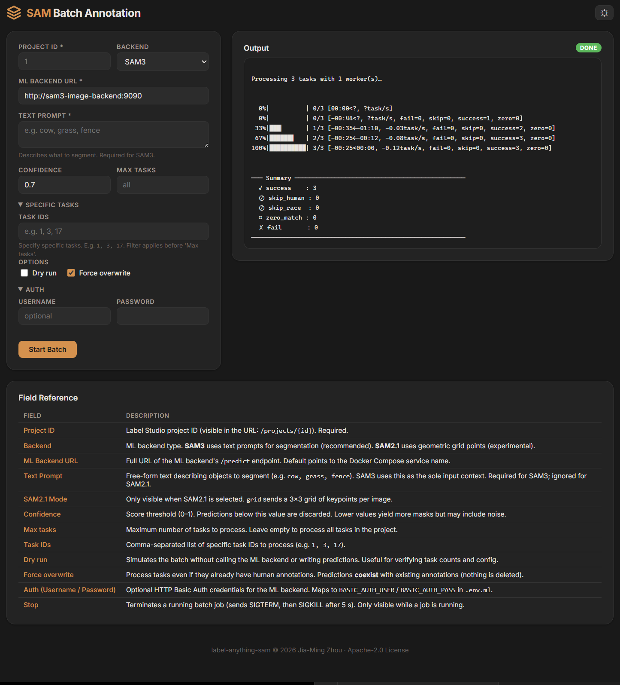
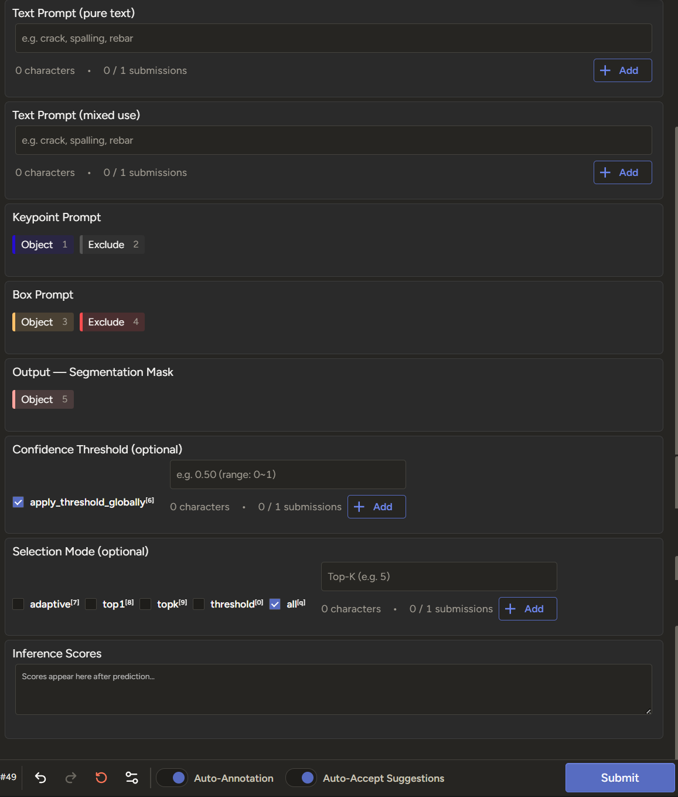

# label-anything-sam

[](LICENSE)


English version: [README.md](README.md)

## 為何有這個專案

截至 2026-04，上游 [Label Studio ML backend](https://github.com/HumanSignal/label-studio-ml-backend) 尚未提供可直接用於生產部署的 SAM3 整合路徑。本專案提供可落地的完整堆疊：

- 核心服務：Label Studio + PostgreSQL + Redis + MinIO + Nginx + Cloudflare Tunnel
- 可選 GPU 疊加：SAM3 影像/影片後端與 SAM2.1 影像/影片後端
- 以安全為先的預設：S3 最小權限、Token 使用規範、對外暴露邊界

> [!NOTE]
> 版本使用建議：
>
> - `main` 與 `v1.1.2` 已包含所有 SAM3 修正與強化：
>   影像 + 影片原生 point embedding、遮罩選擇模式（`adaptive`/`top1`/`topk`/`threshold`/`all`）、
>   執行期門檻與選擇模式 UI 覆蓋、雙向影片追蹤、多物件 track 合併、
>   純文字 / 混合用途雙提示欄位。
> - **若不使用 Supabase、希望 Label Studio 使用原生 PostgreSQL，請使用 `v1.0.2`（基於 Supabase 導入前基線的 hotfix 線）。**
> - 取得版本可用以下方式：
>   1. 用 git checkout（本機開發建議）
>   2. 到對應 Release 下載 `Source code (zip)`
>   3. 在 GitHub 介面切換 Branch/Tag
>
> ```bash
> git fetch --tags
> git checkout tags/v1.1.2 -b local-main-v1.1.2
> # 或
> git checkout tags/v1.0.2 -b local-v1-native-pg
> ```
>
> 在 `v1.0.2` 中，Label Studio 資料會儲存在原生 PostgreSQL（`pg-db`），不需要 `.env.supabase` 與 `make supabase-up`。

## 快速開始

```bash
git clone https://github.com/felimet/label-anything-sam
cd label-anything-sam

# 1) 核心服務
cp .env.example .env
# 本分支預設 Label Studio 會連 Supabase standalone pooler
cp .env.supabase.example .env.supabase
# 填入所有 <PLACEHOLDER>
# LABEL_STUDIO_USER_TOKEN 必須 <= 40 字元（建議：openssl rand -hex 20）
# 重要：.env 與 .env.supabase 的 POSTGRES_PASSWORD 必須相同

make supabase-up
make up
make init-minio

# 2) 可選 ML 後端（需 GPU）
cp .env.ml.example .env.ml
# 設定 LABEL_STUDIO_API_KEY（Legacy Token）與 HF_TOKEN

make ml-up

# 3) 可選 RedisInsight（Redis GUI）
cp .env.tools.example .env.tools
make tools-up

# 4) Supabase 管理指令別名
# （步驟 1 已先啟動，確保預設 DB 路徑可用）
# make supabase-up / make supabase-down / make supabase-logs
```

供 Label Studio 使用的示例模式最小集合（不納入本分支運作流程）：

```bash
# 僅示例配對：
# docker-compose.supabase.sample.yml + .env.supabase.sample.template
cp .env.supabase.sample.template .env.supabase.sample
make supabase-sample-up SUPABASE_SAMPLE_ENV=.env.supabase.sample
```

可選的 Cloudflare Tunnel 管理面路由請直接在 Cloudflare UI 設定（不是填 env 變數），例如：

```text
supabase-studio.example.com -> http://supabase-studio:3000
supabase-meta.example.com   -> http://supabase-meta:8080
redisinsight.example.com    -> http://redisinsight:5540
```

若有調整 `SUPABASE_META_CONTAINER_PORT`，請同步更新 Cloudflare 中 `supabase-meta` 目標埠號。

完整對映與 CF Access 建議請見 [docs/cloudflare-tunnel.md](docs/cloudflare-tunnel.md)。

開啟：

- Label Studio：`http://localhost:18090`
- MinIO Console：`http://localhost:19001`
- MinIO Full Admin UI：`http://localhost:19002`

檢查服務健康：

```bash
make health
```

## 直接手打 Compose（不走 Make）

若你偏好直接手打 `docker compose -f ... up`，建議同時啟用兩層保護：

1. 解析層保護：固定 `project name` 並明確指定 `--env-file`。
2. 容器層保護：保留服務內 `env_file`（例如 ML）與 compose 內 `${VAR:?}` 必填檢查。

PowerShell 建議先設定：

```powershell
$env:COMPOSE_PROJECT_NAME = "label-anything-sam"
```

Supabase standalone（本分支預設）：

```bash
docker compose --project-name label-anything-sam \
	--env-file .env --env-file .env.supabase \
	-f docker-compose.supabase.yml up -d
```

Supabase 示例模式：

```bash
docker compose --project-name label-anything-sam \
	--env-file .env --env-file .env.supabase.sample \
	-f docker-compose.yml -f docker-compose.override.yml -f docker-compose.supabase.sample.yml up -d
```

ML 疊加層：

```bash
docker compose --project-name label-anything-sam \
	--env-file .env \
	-f docker-compose.yml -f docker-compose.override.yml -f docker-compose.ml.yml up -d
```

可選備援（不帶 `--env-file` 時）：

```powershell
$env:COMPOSE_ENV_FILES = ".env,.env.supabase"
docker compose -f docker-compose.supabase.yml config -q
```

注意：`COMPOSE_ENV_FILES` 只有在命令列沒有提供 `--env-file` 時才會生效。

## 開始前請先注意

- ML 後端必須使用 **Legacy Token**，不可使用 Personal Access Token。
- Label Studio 連 S3 請用 `MINIO_LS_ACCESS_ID` / `MINIO_LS_SECRET_KEY`，不要使用 root 帳密。
- MinIO Console（`minio-console.*`）登入請使用管理者帳號（root 或 `consoleAdmin`），不要使用 `MINIO_LS_ACCESS_ID`；該最小權限帳號僅供 S3 API，誤用在 Console 可能出現 `/api/v1/session` 500。
- 首次部署完成後，請立即輪換 MinIO service account 密碼。
- 變更 `.env` 後請用 `down` + `up` 重建容器，不要只做 `restart`。

## 環境檔分層

為避免單一 env 檔過長，變數按範圍拆分：

- `.env.example` → `.env`：核心執行堆疊（必填）
- `.env.ml.example` → `.env.ml`：SAM3/SAM2.1 後端（選填）
- `.env.tools.example` → `.env.tools`：RedisInsight 等本機工具（選填）
- `.env.supabase.example` → `.env.supabase`：Supabase 獨立管理 stack（必填）
- `.env.supabase.sample.template` → `.env.supabase.sample`：Supabase 示例模式最小集合（僅文檔示例）

Supabase 模式邊界：

- 本分支運作模式：`docker-compose.supabase.yml` + `.env.supabase`
- 僅示例模式：`docker-compose.supabase.sample.yml` + `.env.supabase.sample`

`.env.example` 為唯一完整核心模板。

## 依角色閱讀

| 角色 | 起點 | Cookbook | 深入文件 |
|------|------|----------|----------|
| 使用者 / 專案管理者 | [docs/README.md](docs/README.md) | [docs/cookbook/user-cookbook.md](docs/cookbook/user-cookbook.md) | [docs/user-guide.md](docs/user-guide.md) |
| 開發者 | [docs/README.md](docs/README.md) | [docs/cookbook/developer-cookbook.md](docs/cookbook/developer-cookbook.md) | [docs/CONTRIBUTING.md](docs/CONTRIBUTING.md) |
| 維運 / SRE | [docs/README.md](docs/README.md) | [docs/cookbook/ops-cookbook.md](docs/cookbook/ops-cookbook.md) | [docs/RUNBOOK.md](docs/RUNBOOK.md) |

## 文件地圖

- [docs/README.md](docs/README.md)：文件入口與閱讀路線
- [docs/user-guide.md](docs/user-guide.md)：使用者流程與管理操作
- [docs/configuration.md](docs/configuration.md)：環境變數單一真相來源
- [docs/architecture.md](docs/architecture.md)：拓撲、資料流與安全設計
- [docs/cloudflare-tunnel.md](docs/cloudflare-tunnel.md)：對外暴露、Tunnel、WAF
- [docs/sam3-backend.md](docs/sam3-backend.md)：SAM3 後端行為與限制
- [docs/sam21-backend.md](docs/sam21-backend.md)：SAM2.1 後端行為與限制
- [docs/RUNBOOK.md](docs/RUNBOOK.md)：維運、事故排除、備份與還原
- [docs/CONTRIBUTING.md](docs/CONTRIBUTING.md)：開發流程與貢獻規範

## 常用 Make 指令（精簡）

- `make up / down / restart / logs / ps`：核心服務生命週期
- `make ml-up / ml-down`：核心服務 + ML 疊加層
- `make tools-up / tools-down / tools-logs`：RedisInsight 本機 GUI 疊加層
- `make supabase-up / supabase-down / supabase-logs`：Supabase 管理（standalone stack，預設）
- `make supabase-standalone-up / supabase-standalone-down / supabase-standalone-logs`：明確指定 standalone 別名
- `make supabase-sample-up / supabase-sample-down / supabase-sample-logs`：Supabase 最小示例模式（studio + meta）
- `make build-sam3-image / build-sam3-video / build-sam21-image / build-sam21-video`：建置 ML 映像
- `make test-sam3-image / test-sam3-video / test-sam21-image / test-sam21-video`：執行 ML 後端測試
- `make init-minio`：首次建立 bucket 與 service account
- `make health`：全棧健康檢查

## 批量標注

一行指令對整個 Label Studio 專案執行 SAM3/SAM2.1 推論，支援 CLI 與瀏覽器 Web UI（無需終端機）。

```bash
# CLI：對 project 1 執行 SAM3 批量標注
python scripts/batch_annotate.py --project-id 1 --backend sam3 \
    --text-prompt "cow, grass, fence"
# 或
make batch-annotate PROJECT_ID=1

# Web UI：瀏覽器開啟 http://<your-server>:8085
make batch-server
```



完整 CLI 參數說明、SAM3 vs SAM2.1 差異、並發設定與 Web UI 部署，請參閱
[docs/batch-annotation.md](docs/batch-annotation.md)。

## Label Studio Annotation UI (SAM3-image)



## 授權

Apache-2.0 © 2026 Jia-Ming Zhou
