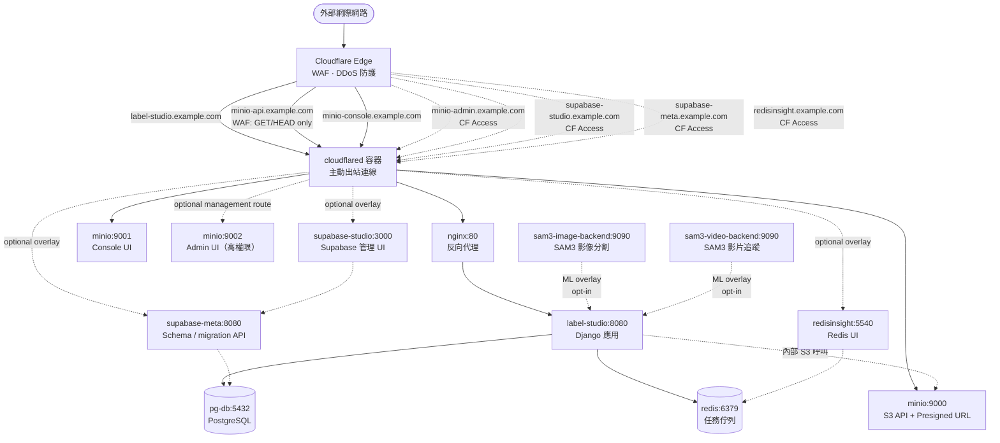
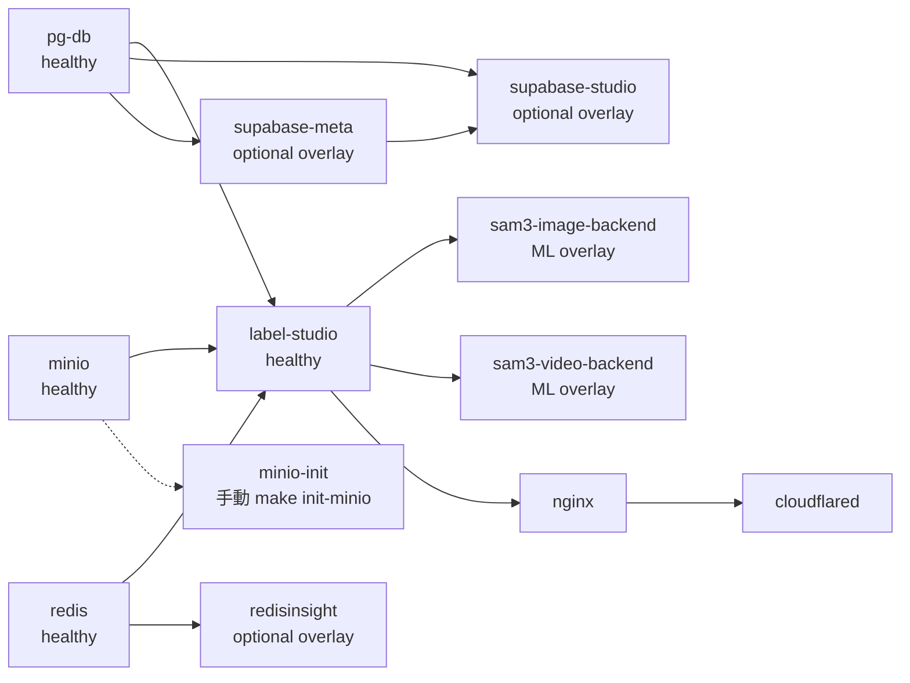
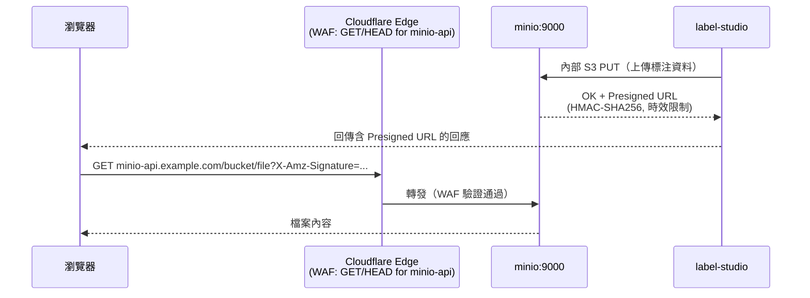

# 系統架構

> 讀者對象：架構設計者、開發者、維運
>
> 本文件涵蓋：拓撲、服務依賴、資料流與安全設計決策
>
> 本文件不涵蓋：部署命令與排障步驟（請見 [RUNBOOK.md](RUNBOOK.md)）
>
> 任務導覽入口： [README.md](README.md)

## 服務拓撲



## 服務啟動相依關係



## Presigned URL 資料流



## Docker Volumes

| Volume / 路徑 | 類型 | 掛載服務 | 內容 |
|---------------|------|----------|------|
| `./postgres-data` | bind mount | pg-db | PostgreSQL 資料檔 |
| `./redis-data` | bind mount | redis | Redis AOF / RDB |
| `./minio-data` | bind mount | minio | 物件儲存資料 |
| `./ls-data` | bind mount | label-studio | 媒體檔、匯出、上傳；host 端可直接觀察 |
| `./ls-data/file` | bind mount | label-studio | Local files storage 根目錄（容器內 `/label-studio/data/file`） |
| `hf-cache` | named volume | sam3-image-backend, sam3-video-backend | HuggingFace Hub 快取（`~/.cache/huggingface`） |
| `sam3-image-models` | named volume | sam3-image-backend | SAM3 影像模型權重（`/data/models`） |
| `sam3-video-models` | named volume | sam3-video-backend | SAM3 影片模型權重（`/data/models`） |

## 內部網路

所有服務共用 `internal` bridge 網路（`172.20.0.0/16`）。正式環境無任何埠號暴露於主機，所有流量由 cloudflared 進入。

本機開發（`docker-compose.override.yml`）額外暴露：

| 服務 | 主機埠號 | 說明 |
|------|----------|------|
| nginx | 18090 | Label Studio 反向代理入口 |
| label-studio | 18086 | Django 應用直連（繞過 nginx） |
| minio API | 19000 | S3 端點（`aws s3`、SDK、presigned URL） |
| minio console | 19001 | MinIO 後台管理 UI（`http://localhost:19001`） |
| minio admin | 19002 | MinIO Full Admin UI（`http://localhost:19002`） |
| postgres | 5433 | 避免與本機 PostgreSQL 衝突 |
| redis | 16380 | 避免與本機 Redis 衝突 |

選用疊加層（預設僅綁 loopback）：

| 服務 | 主機埠號 | 說明 |
|------|----------|------|
| supabase-studio | 127.0.0.1:18091 | Supabase 管理 UI（建議僅內部 + CF Access） |
| supabase-meta | 127.0.0.1:18087 | PostgreSQL schema / migration API（建議僅內部 + CF Access） |
| redisinsight | 127.0.0.1:15540 | Redis GUI（建議僅內部 + CF Access） |

## SAM3 ML 疊加層

SAM3 後端為**選用疊加層**，定義於 `docker-compose.ml.yml`。兩個後端共用同一個 `internal` bridge 網路（由 base compose 建立，project name `label-studio`）：

```bash
make up       # 核心服務（不含 SAM3，無需 GPU）
make ml-up    # 核心服務 + SAM3 影像 + 影片後端（需 NVIDIA GPU）
make ml-down  # 停止所有服務（含核心 + SAM3）
```

`docker-compose.ml.yml` 不設定 `name:` 欄位，避免覆蓋 base project name 而造成網路隔離。

## Nginx 架構設計

本專案使用**獨立的 nginx:alpine 容器**作為反向代理，而非使用官方 Label Studio 映像中內建的 nginx。這個設計選擇提供更高的架構清晰度與靈活性：

| 面向 | 本專案設計 | 官方捆綁式 nginx |
|------|----------|-----------|
| 容器隔離 | nginx 與 Label Studio 分離 | 同一容器內 nginx + app |
| Volume 需求 | nginx 無需掛載資料 volume（僅代理） | nginx 需掛載 `/label-studio/data` 以直接提供媒體 |
| 設定複雜度 | 標準 nginx 設定檔；易於自訂 WAF、客製化首頁等 | nginx 設定內嵌於 LS 程式碼 |
| 關注點分離 | 應用層（LS）與網路層（nginx）明確分離 | 邏輯耦合度高 |

**本專案 nginx 流程**：
```
使用者請求 → nginx:80 → label-studio:8080 → 回傳資料給瀏覽器
```

nginx 純粹充當反向代理角色，將所有請求轉發至 Label Studio app。Label Studio 以內部 URL（`http://minio:9000`）呼叫 MinIO；Presigned URL 直接由 Label Studio 生成並傳給前端，瀏覽器透過 Cloudflare CDN 直接取得檔案。

**為何不在 nginx 中掛載資料 volume**：
- nginx 不需要存取磁碟上的媒體檔（所有檔案存取均走 Label Studio 應用邏輯）
- `./ls-data/` 內的檔案用於 Label Studio 的 Local Files Storage 功能，nginx 無需存取
- 若確實需要 nginx 直接提供靜態檔案，可在 `docker-compose.override.yml` 額外掛載（見 [configuration.md](configuration.md#本機資料目錄說明)）

## 安全設計決策

| 決策 | 理由 |
|------|------|
| MinIO WAF：僅 GET/HEAD | Presigned URL 已有 HMAC 驗證；防止資料竄改與儲存桶列舉 |
| MinIO 分流保護 | `minio-api` 不使用 CF Access（避免破壞 Presigned URL）；`minio-admin` 必須使用 CF Access；`minio-console` 建議使用 CF Access |
| `SSRF_PROTECTION_ENABLED=false` | Label Studio 需呼叫內部 `minio:9000`；僅對可信內部網段放行 |
| 非 root 使用者（uid 1001） | SAM3 容器與 Label Studio 容器均以非 root 身份執行 |
