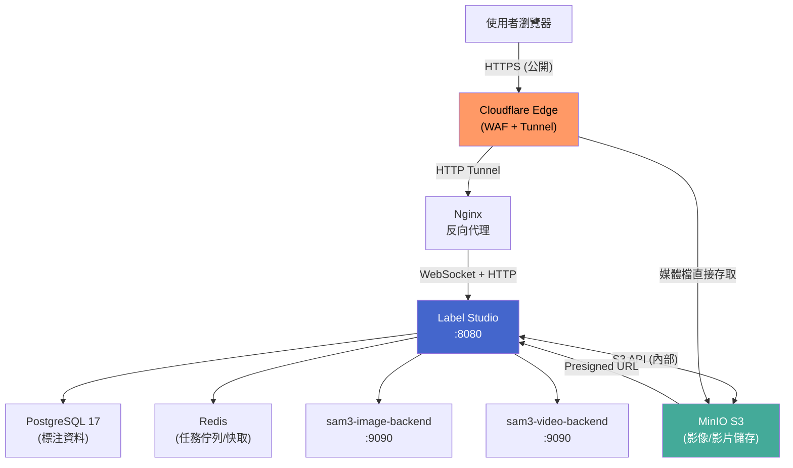
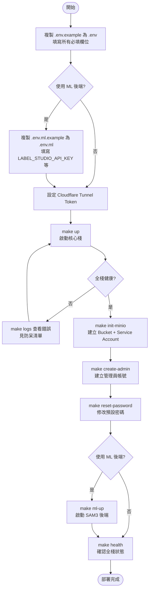
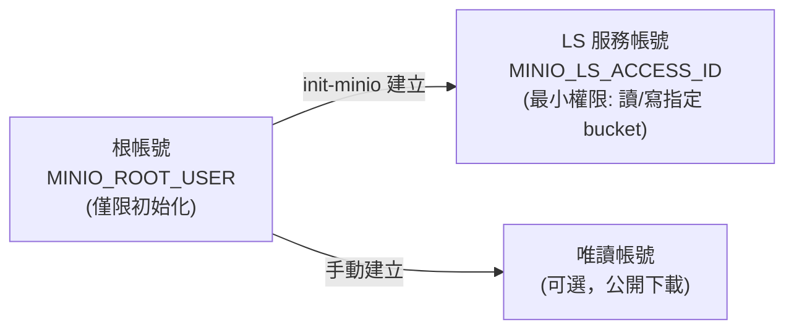
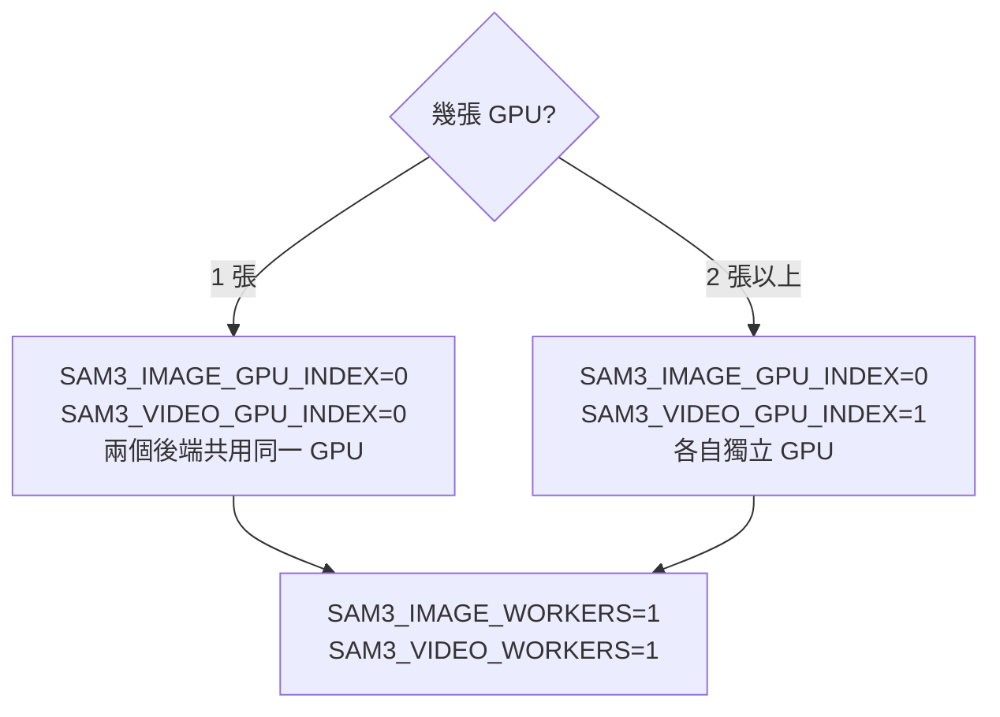
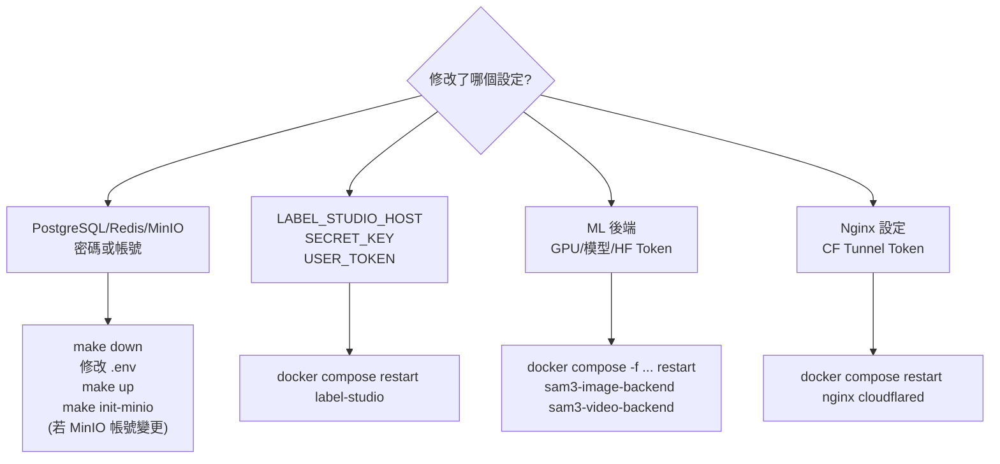

# Label Studio 使用者操作與設定指南

> 讀者對象：使用者、專案管理者、初次部署者
>
> 本文件涵蓋：部署流程、常見設定、防呆清單、使用者管理
>
> 本文件不涵蓋：完整環境變數細節（請見 [configuration.md](configuration.md)）與進階維運排障（請見 [RUNBOOK.md](RUNBOOK.md)）
>
> 快速任務路徑： [README](README.md) → [cookbook/user-cookbook.md](cookbook/user-cookbook.md)

---

## 目錄

1. [架構概覽](#架構概覽)
2. [首次部署流程](#首次部署流程)
3. [核心設定說明](#核心設定說明)
4. [ML 後端設定](#ml-後端設定)
5. [常見錯誤與防呆清單](#常見錯誤與防呆清單)
6. [設定變更後的重啟順序](#設定變更後的重啟順序)
7. [管理員與使用者管理](#管理員與使用者管理)

---

## 架構概覽



**進入點只有一個**：所有外部流量皆透過 Cloudflare Tunnel 進入，nginx 不對外暴露。開發環境另有 `docker-compose.override.yml` 會直接暴露埠號。

---

## 首次部署流程



> **`make init-minio` 只在首次部署時執行一次**。重複執行是安全的（冪等），但不需要。

---

## 核心設定說明

### .env 必填欄位一覽

| 欄位 | 說明 | 常見錯誤 |
|------|------|----------|
| `POSTGRES_PASSWORD` | PostgreSQL 密碼 | 使用預設值或過短密碼 |
| `REDIS_PASSWORD` | Redis 密碼 | 留空（Redis 預設無密碼，但本設定強制要求） |
| `MINIO_ROOT_USER` / `MINIO_ROOT_PASSWORD` | MinIO 根帳號 | 密碼少於 8 字元會導致 MinIO 啟動失敗 |
| `MINIO_LS_ACCESS_ID` / `MINIO_LS_SECRET_KEY` | LS 用的最小權限金鑰 | 直接使用根帳號（安全風險） |
| `MINIO_EXTERNAL_HOST` | MinIO 對外域名 | 不含 `https://` 前綴（只填域名） |
| `LABEL_STUDIO_HOST` | LS 對外 URL | **必須含 `https://` 前綴** |
| `LABEL_STUDIO_SECRET_KEY` | Django 加密金鑰 | 使用預設值或過短 |
| `LABEL_STUDIO_USER_TOKEN` | API Token | **超過 40 字元會導致 DB 寫入失敗** |
| `CLOUDFLARE_TUNNEL_TOKEN` | CF Zero Trust Token | 遺漏或使用錯誤 Tunnel 的 Token |

### 重要限制

#### `LABEL_STUDIO_USER_TOKEN` 長度限制

```
⚠️  Django Token 欄位 max_length=40
    使用 openssl rand -hex 20 產生（40 字元 hex）
    不要用 openssl rand -hex 32（64 字元，超過上限）
```

#### `LABEL_STUDIO_HOST` 格式

```
✓  LABEL_STUDIO_HOST=https://label.example.com
✗  LABEL_STUDIO_HOST=label.example.com           # 缺少協定頭
✗  LABEL_STUDIO_HOST=https://label.example.com/  # 結尾斜線
```

#### MinIO 域名格式

```
✓  MINIO_EXTERNAL_HOST=minio.example.com          # 只填域名
✗  MINIO_EXTERNAL_HOST=https://minio.example.com  # 不含協定
```

### MinIO 帳號權限層級



**初始化後請勿將根帳號用於日常操作**。根帳號僅在 `minio-init` 服務執行時使用，之後 LS 一律透過 `MINIO_LS_ACCESS_ID` 連接。

---

## ML 後端設定

### .env.ml 必填欄位

| 欄位 | 說明 | 注意 |
|------|------|------|
| `LABEL_STUDIO_API_KEY` | 與 `.env` 的 `LABEL_STUDIO_USER_TOKEN` **相同值** | 必須是 Legacy Token，不是 Personal Access Token |
| `HF_TOKEN` | HuggingFace Hub Token | SAM3 是 gated model，必須先在 HF 網頁同意授權 |
| `DEVICE` | `cuda` 或 `cpu` | CPU 推論速度極慢，不建議用於生產 |

### GPU 設定



> `WORKERS` 的數量應等於分配給該後端的 GPU 數量。一個 GPU 跑多個 workers 會造成 VRAM OOM。

### Legacy Token 與 Personal Access Token 的差異

ML 後端必須使用 **Legacy Token**（即 `LABEL_STUDIO_USER_TOKEN`）：

```
✓  LABEL_STUDIO_USER_TOKEN=<openssl rand -hex 20>
   → 填入 .env.ml 的 LABEL_STUDIO_API_KEY

✗  在 LS 介面建立的 Personal Access Token（格式不同，ML 後端不接受）
```

在 `.env` 中確認 `LABEL_STUDIO_DISABLE_LEGACY_API_TOKEN=false`（預設值），否則 Legacy Token 會被停用。

### HuggingFace Model 授權

SAM3 系列模型是 **gated model**，首次使用前需要：

1. 登入 [huggingface.co](https://huggingface.co)
2. 前往模型頁面（`facebook/sam3`、`facebook/sam3.1`）
3. 點擊「Agree and access repository」
4. 在 [HF Settings > Tokens](https://huggingface.co/settings/tokens) 建立具備「Read」權限的 Token
5. 填入 `.env.ml` 的 `HF_TOKEN`

模型首次下載後會快取至 `hf-cache/` named volume，後續重啟不需要重新下載。

---

## 常見錯誤與防呆清單

### 部署前檢查

- [ ] `.env` 中所有 `<...>` placeholder 都已替換為實際值
- [ ] `LABEL_STUDIO_USER_TOKEN` 長度 ≤ 40 字元
- [ ] `LABEL_STUDIO_HOST` 以 `https://` 開頭，結尾無斜線
- [ ] `MINIO_EXTERNAL_HOST` 只填域名，不含 `https://`
- [ ] `MINIO_ROOT_PASSWORD` 長度 ≥ 8 字元
- [ ] `CLOUDFLARE_TUNNEL_TOKEN` 與 CF Zero Trust Dashboard 中的 Tunnel 對應
- [ ] ML 後端的 `LABEL_STUDIO_API_KEY` 與 `.env` 的 `LABEL_STUDIO_USER_TOKEN` 一致

### 啟動後確認

```bash
make health   # 全棧健康檢查
make ps       # 確認所有服務 Status=healthy
```

預期輸出：所有服務顯示 `healthy` 或 `Up`，`minio-init` 顯示 `Exited (0)`（正常，one-shot 任務）。

### 問題對照表

| 問題 | 可能原因 | 確認方式 |
|------|----------|----------|
| LS 顯示 500 / DB 錯誤 | `POSTGRES_PASSWORD` 不一致 | `make logs` 查 label-studio 服務 |
| MinIO 無法啟動 | `MINIO_ROOT_PASSWORD` 少於 8 字元 | `make logs` 查 minio 服務 |
| ML 後端 401 Unauthorized | `LABEL_STUDIO_API_KEY` 錯誤，或用了 PAT | 確認 `.env.ml` 與 `.env` 的 token 一致 |
| 影像無法顯示 / Presigned URL 失敗 | `MINIO_EXTERNAL_HOST` 格式錯誤 | 確認域名格式，不含協定頭 |
| CF Tunnel 無法連線 | Token 對應到錯誤 Tunnel | CF Zero Trust Dashboard 確認 Tunnel ID |
| ML 後端 CUDA OOM | WORKERS 數 > GPU 數 | 降低 `SAM3_*_WORKERS` 至 1 |
| Token 寫入 DB 失敗 | `USER_TOKEN` 超過 40 字元 | 使用 `openssl rand -hex 20` |
| HF 模型下載失敗 403 | HF Token 權限不足或未同意 gated model | 確認 HF 模型頁面授權狀態 |

---

## 設定變更後的重啟順序



> **修改 `.env` 後必須重新建立容器（`down` + `up`）**，`restart` 只重啟服務但不重載環境變數。

---

## 管理員與使用者管理

### 首次部署後修改管理員密碼

`.env.example` 內的 `LABEL_STUDIO_PASSWORD` 為預設值，**部署完成後務必立即修改**：

```bash
make reset-password
```

執行後會互動式提示輸入新密碼，使用者名稱從 `.env` 的 `LABEL_STUDIO_USERNAME` 讀取。

> `make create-admin` 是冪等操作（帳號已存在則跳過），不會覆蓋現有密碼。若需重設請用 `make reset-password`。

### 使用者管理（社區版限制）

Label Studio **社區版不提供 UI 使用者管理功能**，Organization 頁面的成員管理（如移除、角色設定）屬於 Enterprise 功能。

社區版的使用者管理透過 **Django shell CLI** 操作。

#### 新增 superuser（管理員）

```bash
make create-admin
```

#### 新增一般使用者

```bash
docker compose exec label-studio python /label-studio/label_studio/manage.py shell -c "
from users.models import User
from organizations.models import Organization
u = User.objects.create_user(email='user@example.com', password='changeme')
Organization.objects.first().add_member(u)
print(f'Created: {u.email}')
"
```

> 也可在 Label Studio UI 中產生邀請連結。

#### 刪除使用者

```bash
docker compose exec label-studio python /label-studio/label_studio/manage.py shell -c "
from users.models import User
count, _ = User.objects.filter(email='user@example.com').delete()
print(f'Deleted {count} user(s)')
"
```

```
⚠️  刪除帳號為不可逆操作。
    該帳號建立的標注 task 仍會保留，但 created_by 關聯將變為空值。
```

#### 列出所有使用者

```bash
docker compose exec label-studio python /label-studio/label_studio/manage.py shell -c "
from users.models import User
for u in User.objects.all().order_by('email'):
    print(f'{u.email}  superuser={u.is_superuser}  active={u.is_active}')
"
```

---

## 快速指令參考

```bash
# 啟動與停止
make up           # 啟動核心棧
make down         # 停止核心棧
make ml-up        # 啟動含 ML 後端
make ml-down      # 停止含 ML 後端

# 狀態確認
make ps           # 服務狀態
make health       # 全棧健康檢查
make logs         # 即時日誌 (tail=100)

# 初始化（首次部署用）
make init-minio   # MinIO bucket + 服務帳號
make create-admin   # 建立 LS 管理員（冪等）
make reset-password # 修改管理員密碼（互動式）

# 建置 ML 後端映像
make build-sam3-image
make build-sam3-video
```
